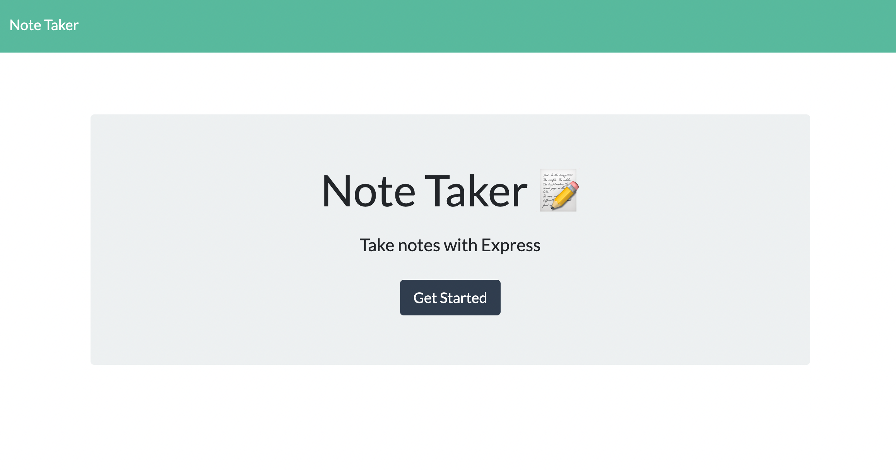
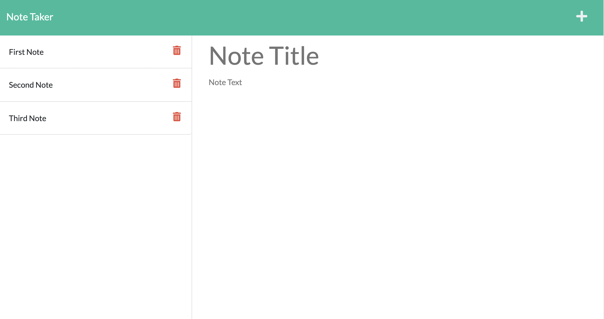

# Note Taker
## Description
This is a Note Taker application that can be used to write, save and delete notes. This application uses ExpressJS in the back end to save and retrieve note data from a JSON file.

## Table of Contents
* [Screenshot](#Screenshots)
* [Link](#Link)
* [License](#License)
* [Questions](#Questions)
 
## Screenshots

## Link
[Deployed Application at Heroku](https://agile-atoll-94244.herokuapp.com/)

## License
This Application is covered under MITLicense

For more information about the License visit [MIT License Page](https://choosealicense.com/licenses/mit/)
## Questions
For further questions please contact me at:

GitHub: [https://github.com/hekmatsalehi](https://github.com/hekmatsalehi)

Email: [hekmatullahsalehi@gmail.com](mailto:hekmatullahsalehi@gmail.com)